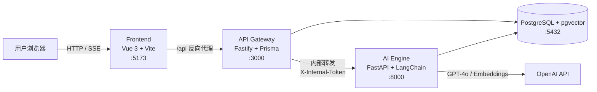
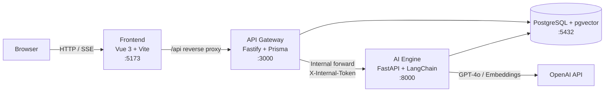

# KA App · 知识库助手管理平台

KA App 是一个基于 RAG（Retrieval-Augmented Generation，检索增强生成）的知识库问答平台。用户上传私有文档后，系统自动完成解析、分块与向量化；提问时，系统从知识库中检索最相关的内容片段，由大语言模型基于这些内容流式生成回答，并附带引用来源。

> 本文档提供中英文两个版本。[English Version](#english-version)

---

## 功能特性

| 功能 | 说明 |
|------|------|
| 用户认证 | 注册、登录、JWT 令牌，`admin` 与 `user` 两种角色 |
| 知识库管理 | 支持创建多个知识库，每个知识库可独立配置分块策略与检索参数 |
| 文档处理 | 支持 PDF、TXT、Markdown、DOCX、HTML，上传后自动解析、分块、向量化 |
| 流式对话 | 基于 SSE 的逐字输出，回答附带引用来源（文档名与相似度） |
| 对话记忆 | 滑动窗口机制，保留最近 20 条消息作为上下文 |
| 数据仪表盘 | 知识库、文档、对话统计，以及近 30 天对话趋势 |

---

## 系统架构

系统由三个相互独立的服务组成：



| 层 | 技术栈 | 职责 | 选型理由 |
|----|--------|------|----------|
| Frontend | Vue 3 + Element Plus | 界面展示与交互 | 组件完善，适合管理类后台界面 |
| API Gateway | Node.js + Fastify | 认证、业务 CRUD、文件上传、SSE 代理 | 适合高并发 I/O 场景，生态成熟 |
| AI Engine | Python + FastAPI | RAG 管道、大模型调用、向量检索 | Python 拥有最成熟的 AI 生态 |

### 架构设计理由

1. **职责分离**：Node.js 适合处理高并发请求与业务逻辑，Python 具备完整的 AI 工具链，二者分工明确。
2. **故障隔离**：AI 引擎不可用时，登录、知识库管理、历史记录等功能不受影响，系统仅降级 AI 问答能力。
3. **独立伸缩**：AI 负载增长时，可单独对 Python 服务扩容，不影响网关与前端。

---

## 技术栈

| 分类 | 技术 |
|------|------|
| 前端框架 | Vue 3.5 + TypeScript + Vite 8 |
| UI 组件库 | Element Plus |
| 状态管理 | Pinia |
| API 网关 | Node.js + Fastify 5 |
| ORM | Prisma |
| AI 后端 | Python 3.11+ + FastAPI |
| RAG 框架 | LangChain |
| 大语言模型 | OpenAI GPT-4o + text-embedding-3-small |
| 向量存储 | PostgreSQL 16 + pgvector（HNSW 索引） |
| 文档解析 | PyMuPDF / python-docx / BeautifulSoup |
| 容器化 | Docker Compose |
| 包管理 | pnpm（Node.js）、pip（Python） |

---

## 目录结构

```
ka-app/
├── frontend/          # Vue 3 前端应用        详见 frontend/README.md
├── api-gateway/       # Node.js API 网关      详见 api-gateway/README.md
├── ai-engine/         # Python AI 引擎        详见 ai-engine/README.md
├── docker/            # Docker Compose 配置   详见 docker/README.md
├── scripts/           # 数据库初始化脚本       详见 scripts/README.md
├── docs/              # 项目文档（预留）
└── .gitignore
```

每个子目录均包含独立的 `README.md`，说明该模块的代码结构、设计决策与扩展方法，便于其他开发者阅读与维护。

---

## 快速开始

### 环境要求

- Node.js 20 及以上，pnpm 9 及以上（`api-gateway` 通过 `devEngines` 自动切换至 v11）
- Python 3.11 及以上
- Docker 与 Docker Compose
- OpenAI API Key

### 第一步：启动数据库

```bash
cd docker
docker compose up -d
```

该命令启动两个容器：

- `kb-postgres`：PostgreSQL 16 + pgvector，端口 5432
- `kb-redis`：Redis 7，端口 6379

### 第二步：初始化业务数据表

```bash
cd api-gateway
cp .env.example .env          # 按需修改配置
pnpm install
pnpm db:migrate               # 创建 5 张业务数据表
```

### 第三步：初始化向量表

```bash
# 仅需执行一次（创建 pgvector 扩展与 chunks 表）
# 注意：必须在第二步之后执行，chunks 表的外键引用 documents 与 knowledge_bases
docker exec -i kb-postgres psql -U kb_user -d knowledge_base < ../scripts/init_pgvector.sql
```

### 第四步：启动 API 网关

```bash
cd api-gateway
pnpm dev                      # 启动于 :3000
```

### 第五步：启动 AI 引擎

```bash
cd ai-engine
python -m venv .venv
source .venv/bin/activate     # Windows: .venv\Scripts\activate
pip install -r requirements.txt
cp .env.example .env          # 必须填入 OPENAI_API_KEY
uvicorn app.main:app --reload --port 8000
```

### 第六步：启动前端

```bash
cd frontend
pnpm install
pnpm dev                      # 启动于 :5173，开发服务器自动代理 /api 至 :3000
```

访问 [http://localhost:5173](http://localhost:5173)，注册账号后即可使用。

> 说明：新注册账号的角色默认为 `user`。如需管理员权限，请在数据库 `users` 表中将目标用户的 `role` 字段手动修改为 `admin`。

---

## 环境变量

各服务均提供 `.env.example` 模板，复制为 `.env` 后按需修改：

| 服务 | 变量 | 说明 |
|------|------|------|
| api-gateway | `DATABASE_URL` | PostgreSQL 连接串 |
| api-gateway | `JWT_SECRET` | JWT 签名密钥，生产环境必须修改 |
| api-gateway | `INTERNAL_API_TOKEN` | 调用 AI 引擎的内部令牌 |
| ai-engine | `OPENAI_API_KEY` | 必填，OpenAI API 密钥 |
| ai-engine | `INTERNAL_API_TOKEN` | 必须与 api-gateway 保持一致 |
| ai-engine | `EMBEDDING_MODEL` | 向量模型，默认 `text-embedding-3-small` |

---

## 核心数据流

### 文档上传

```
用户上传 -> 网关保存文件并创建 Document 记录
         -> 通知 AI 引擎 -> 后台任务：解析 -> 分块 -> 向量化 -> 写入 chunks 表
         -> 前端轮询状态直至处理完成
```

### 智能问答

```
用户发送消息 -> 网关校验身份并组装上下文
            -> AI 引擎：向量检索 -> 注入参考资料 -> 调用 GPT-4o 流式生成
            -> 逐字回传前端 -> 持久化消息与引用来源
```

---

## 文档索引

各模块的设计细节与扩展方法，请参阅对应子目录的 README：

| 需求 | 参考文档 |
|------|----------|
| 新增前端页面或组件 | [frontend/README.md](frontend/README.md) |
| 新增 API 接口或修改数据模型 | [api-gateway/README.md](api-gateway/README.md) |
| 支持新文件格式或更换向量模型 | [ai-engine/README.md](ai-engine/README.md) |
| 调整数据库或基础设施 | [docker/README.md](docker/README.md)、[scripts/README.md](scripts/README.md) |

---

## 许可证

MIT

---

<a id="english-version"></a>

# KA App · Knowledge Base Assistant Platform

KA App is a knowledge base Q&A platform based on RAG (Retrieval-Augmented Generation). Users upload private documents, which the system automatically parses, chunks, and vectorizes. When a question is asked, the system retrieves the most relevant passages from the knowledge base, and a large language model streams an answer grounded in that content, complete with citations.

---

## Features

| Feature | Description |
|---------|-------------|
| Authentication | Registration, login, JWT tokens, `admin` and `user` roles |
| Knowledge Bases | Multiple knowledge bases, each with independent chunking and retrieval configuration |
| Document Processing | PDF, TXT, Markdown, DOCX and HTML, automatically parsed, chunked and vectorized |
| Streaming Chat | SSE token-by-token output with citation sources (document name and similarity) |
| Conversation Memory | Sliding window retaining the last 20 messages as context |
| Dashboard | Knowledge base, document and conversation statistics with 30-day trends |

---

## Architecture

The system consists of three independent services:



| Layer | Tech Stack | Responsibility | Rationale |
|-------|-----------|----------------|-----------|
| Frontend | Vue 3 + Element Plus | UI and interaction | Mature components, well suited to admin interfaces |
| API Gateway | Node.js + Fastify | Auth, CRUD, uploads, SSE proxy | Well suited to high-concurrency I/O, mature ecosystem |
| AI Engine | Python + FastAPI | RAG pipeline, LLM calls, vector search | Python has the most mature AI ecosystem |

### Design Rationale

1. **Separation of concerns**: Node.js handles concurrency and business logic; Python provides the full AI toolchain. Each does what it does best.
2. **Fault isolation**: If the AI engine is unavailable, login, knowledge base management and history remain functional; only AI Q&A degrades.
3. **Independent scaling**: The AI service can be scaled independently as load grows, without affecting the gateway or frontend.

---

## Tech Stack

| Category | Technology |
|----------|-----------|
| Frontend | Vue 3.5 + TypeScript + Vite 8 |
| UI Library | Element Plus |
| State Management | Pinia |
| API Gateway | Node.js + Fastify 5 |
| ORM | Prisma |
| AI Backend | Python 3.11+ + FastAPI |
| RAG Framework | LangChain |
| LLM | OpenAI GPT-4o + text-embedding-3-small |
| Vector Storage | PostgreSQL 16 + pgvector (HNSW index) |
| Document Parsing | PyMuPDF / python-docx / BeautifulSoup |
| Containerization | Docker Compose |
| Package Managers | pnpm (Node.js), pip (Python) |

---

## Repository Structure

```
ka-app/
├── frontend/          # Vue 3 frontend         see frontend/README.md
├── api-gateway/       # Node.js API gateway    see api-gateway/README.md
├── ai-engine/         # Python AI engine       see ai-engine/README.md
├── docker/            # Docker Compose config  see docker/README.md
├── scripts/           # Database init scripts  see scripts/README.md
├── docs/              # Project docs (reserved)
└── .gitignore
```

Each subdirectory contains its own `README.md` describing the module's structure, design decisions, and extension points, so that other developers can read and maintain the code with ease.

---

## Getting Started

### Prerequisites

- Node.js 20 or later, pnpm 9 or later (`api-gateway` switches to v11 automatically via `devEngines`)
- Python 3.11 or later
- Docker and Docker Compose
- An OpenAI API Key

### Step 1: Start the databases

```bash
cd docker
docker compose up -d
```

This starts two containers:

- `kb-postgres`: PostgreSQL 16 + pgvector, port 5432
- `kb-redis`: Redis 7, port 6379

### Step 2: Initialize the business tables

```bash
cd api-gateway
cp .env.example .env          # adjust as needed
pnpm install
pnpm db:migrate               # create the 5 business tables
```

### Step 3: Initialize the vector table

```bash
# Run once (creates the pgvector extension and the chunks table)
# Note: must run after Step 2, since chunks has foreign keys to documents and knowledge_bases
docker exec -i kb-postgres psql -U kb_user -d knowledge_base < ../scripts/init_pgvector.sql
```

### Step 4: Start the API gateway

```bash
cd api-gateway
pnpm dev                      # runs on :3000
```

### Step 5: Start the AI engine

```bash
cd ai-engine
python -m venv .venv
source .venv/bin/activate     # Windows: .venv\Scripts\activate
pip install -r requirements.txt
cp .env.example .env          # you MUST set OPENAI_API_KEY
uvicorn app.main:app --reload --port 8000
```

### Step 6: Start the frontend

```bash
cd frontend
pnpm install
pnpm dev                      # runs on :5173, dev server proxies /api to :3000
```

Open [http://localhost:5173](http://localhost:5173), register an account, and start using the platform.

> Note: Newly registered accounts are assigned the `user` role by default. To grant administrator privileges, manually set the user's `role` field to `admin` in the `users` table.

---

## Environment Variables

Each service ships with a `.env.example` template; copy it to `.env` and adjust:

| Service | Variable | Description |
|---------|----------|-------------|
| api-gateway | `DATABASE_URL` | PostgreSQL connection string |
| api-gateway | `JWT_SECRET` | JWT signing secret; must be changed in production |
| api-gateway | `INTERNAL_API_TOKEN` | Internal token for calling the AI engine |
| ai-engine | `OPENAI_API_KEY` | Required; the OpenAI API key |
| ai-engine | `INTERNAL_API_TOKEN` | Must match the gateway's token |
| ai-engine | `EMBEDDING_MODEL` | Embedding model, defaults to `text-embedding-3-small` |

---

## Core Data Flows

### Document upload

```
User uploads -> gateway stores the file and creates a Document record
             -> notifies AI engine -> background task: parse -> chunk -> embed -> write to chunks table
             -> frontend polls status until processing completes
```

### Question answering

```
User sends a message -> gateway verifies identity and assembles context
                     -> AI engine: vector search -> inject references -> stream GPT-4o response
                     -> tokens forwarded to the frontend -> message and citations persisted
```

---

## Documentation Index

For module-level design details and extension guidance, refer to the corresponding subdirectory README:

| Task | Reference |
|------|-----------|
| Add frontend pages or components | [frontend/README.md](frontend/README.md) |
| Add API endpoints or modify data models | [api-gateway/README.md](api-gateway/README.md) |
| Support new file formats or swap embedding models | [ai-engine/README.md](ai-engine/README.md) |
| Adjust the database or infrastructure | [docker/README.md](docker/README.md), [scripts/README.md](scripts/README.md) |

---

## License

MIT
